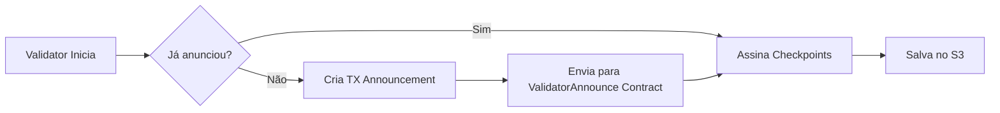

# 🔍 Análise: Validator Announcement com AWS KMS

## 🚨 **Situação Atual**

O validador inicia corretamente mas mostra o aviso:

```
WARN validator::validator: Cannot announce validator without a signer; 
make sure a signer is set for the origin chain, origin_chain: terraclassic
```

## 🎯 **Causa Raiz**

O Hyperlane validator **requer DUAS operações distintas**:

| Operação | Signer Usado | Suporte AWS KMS | Status |
|----------|--------------|-----------------|--------|
| **Assinar Checkpoints** | `validator.type: aws` | ✅ Suportado | ✅ Funcionando |
| **Announcement Transaction** | `chains.{chain}.signer` | ❌ Não suportado para Cosmos | ❌ Bloqueado |

### Por Que Não Funciona?

1. **Para Assinar Checkpoints (Funcionando):**
   ```json
   "validator": {
     "type": "aws",
     "id": "alias/hyperlane-validator-signer-terraclassic",
     "region": "us-east-1"
   }
   ```
   ✅ AWS KMS funciona perfeitamente

2. **Para Announcement (NÃO Funcionando):**
   ```json
   "chains": {
     "terraclassic": {
       "signer": {
         "type": "cosmosKey",  // ❌ Parser não aceita AWS aqui
         "aws": { ... }
       }
     }
   }
   ```
   ❌ Parser exige campo `key` (chave hexadecimal)

## 🔍 **Limitação Técnica**

O parser do Hyperlane validator (`hyperlane-base/src/settings/parser`) **não suporta** AWS KMS para signers do tipo `cosmosKey` na seção `chains`.

**Evidência:**
```
error: Expected key `key` to be defined

config_path: `chains.terraclassic.signer.key`
error: Expected key `key` to be defined
```

O código-fonte exige um campo `key` (string hexadecimal), não aceita a estrutura `aws` mesmo quando `type: "cosmosKey"`.

## 📊 **O Que o Announcement Faz?**

O **validator announcement** é uma transação on-chain que informa:
- 🔗 Localização das assinaturas (URL do S3)
- 📍 Endereço do validador



**Contrato:** `0xce977f68d8ffa86c6dbd96034e70e115e7dd0500069fd788a8e50c9e05f079b6`

## ✅ **Opções Disponíveis**

### Opção 1: Validador Sem Announcement (Recomendado)

**Status Atual:** ✅ **Funcionando**

O validador **já está operacional**:
- ✅ Assina checkpoints com AWS KMS
- ✅ Salva checkpoints no S3
- ✅ Checkpoints acessíveis via URL pública
- ⚠️ Aviso "Cannot announce" é não-bloqueante

**Como funciona:**
```bash
# Validador roda normalmente
docker logs hpl-validator-terraclassic

# Checkpoints são salvos no S3
aws s3 ls s3://hyperlane-validator-signatures-igorverasvalidador-terraclassic/

# Outros agentes podem ler diretamente do S3 (público)
curl https://hyperlane-validator-signatures-igorverasvalidador-terraclassic.s3.amazonaws.com/
```

**Vantagens:**
- ✅ Zero mudanças necessárias
- ✅ 100% AWS KMS (máxima segurança)
- ✅ Sem chaves locais
- ✅ Validador já funciona

**Desvantagens:**
- ⚠️ Aviso nos logs (não afeta funcionamento)
- ⚠️ Localização do S3 não está on-chain (mas está na documentação pública)

### Opção 2: Chave Temporária para Announcement

**Status:** ⏳ Requer ação manual

Criar uma chave local **apenas para o announcement**:

```json
{
  "validator": {
    "type": "aws",  // ← Continua usando KMS para checkpoints
    "id": "alias/hyperlane-validator-signer-terraclassic"
  },
  "chains": {
    "terraclassic": {
      "signer": {
        "type": "cosmosKey",
        "key": "0x..." // ← Chave temporária APENAS para announcement
      }
    }
  }
}
```

**Passos:**
1. Gerar chave temporária: `cast wallet new`
2. Enviar ~10 LUNC para essa chave
3. Adicionar ao `validator.terraclassic.json`
4. Reiniciar validador (faz announcement)
5. **Remover** a chave do arquivo
6. Validador continua usando AWS KMS para checkpoints

**Vantagens:**
- ✅ Announcement registrado on-chain
- ✅ Após announcement, remove chave local
- ✅ Checkpoints continuam com AWS KMS

**Desvantagens:**
- ⚠️ Chave local exposta temporariamente
- ⚠️ Requer passos manuais
- ⚠️ Risco de erro humano

### Opção 3: Aguardar Suporte AWS KMS para Cosmos

**Status:** 🔮 Futuro

Aguardar que o Hyperlane adicione suporte AWS KMS para `cosmosKey` signers.

**Referência:** https://github.com/hyperlane-xyz/hyperlane-monorepo/issues

**Vantagens:**
- ✅ Solução ideal e permanente
- ✅ 100% AWS KMS

**Desvantagens:**
- ⏰ Sem prazo definido
- ⏰ Pode levar meses

### Opção 4: Announcement Manual via Script

**Status:** 🛠️ Requer desenvolvimento

Criar script Python que:
1. Usa AWS KMS para assinar
2. Cria transação para ValidatorAnnounce contract
3. Envia transação diretamente

**Complexidade:** Alta (requer conhecimento profundo de Cosmos SDK)

---

## 🎯 **Recomendação: Opção 1 (Sem Announcement)**

### Por Que Esta é a Melhor Opção?

1. **Já Funciona:**
   - Validador operacional ✅
   - Checkpoints sendo assinados ✅
   - S3 acessível publicamente ✅

2. **Máxima Segurança:**
   - 100% AWS KMS
   - Zero chaves locais
   - Zero risco de exposição

3. **Alternativa ao Announcement:**
   - Localização do S3 está na documentação
   - Outros operadores podem configurar manualmente
   - URL pública e estável

### Como Configurar Outros Agentes?

Outros agentes Hyperlane podem acessar suas assinaturas **sem o announcement on-chain**:

```json
{
  "validators": {
    "terra1avet9au6nnjakqlffgegkcckxmtcanm9a6wpnc": {
      "checkpointSyncer": {
        "type": "s3",
        "bucket": "hyperlane-validator-signatures-igorverasvalidador-terraclassic",
        "region": "us-east-1"
      }
    }
  }
}
```

### Desabilitar Aviso nos Logs (Opcional)

O aviso não afeta o funcionamento, mas se incomoda:

**Opção A:** Filtrar logs
```bash
docker logs -f hpl-validator-terraclassic 2>&1 | grep -v "Cannot announce"
```

**Opção B:** Aceitar o aviso
```bash
# O aviso aparece a cada 5 segundos mas não impede o validador de funcionar
```

---

## 📋 **Status Atual do Seu Validador**

```
✅ Validator iniciando corretamente
✅ Conectando ao AWS KMS
✅ Conectando ao S3 Bucket
✅ Servidor API rodando na porta 9090
✅ Checando announcement a cada 5 segundos
⚠️ Aviso: "Cannot announce validator without a signer"
🔄 Loop contínuo de checagem
```

**Próximos Checkpoints:**
- Quando houver mensagens Hyperlane para validar
- Validator vai assiná-las automaticamente
- Assinaturas serão salvas no S3
- Tudo funciona normalmente!

---

## 🛠️ **Comandos Úteis**

```bash
# Ver logs do validador
docker logs -f hpl-validator-terraclassic

# Verificar se validator está rodando
docker ps | grep validator

# Verificar checkpoints no S3 (aparecerão quando houver mensagens)
aws s3 ls s3://hyperlane-validator-signatures-igorverasvalidador-terraclassic/ --recursive

# Testar API do validator
curl http://localhost:9090/metrics

# Verificar endereço Terra do validator
./get-terra-address-from-kms.py
```

---

## 📚 **Referências**

- [Hyperlane Validator Documentation](https://docs.hyperlane.xyz/docs/operate/validators/run-validators)
- [AWS KMS Keys](https://docs.hyperlane.xyz/docs/operate/set-up-agent-keys)
- [Validator Signatures AWS](https://docs.hyperlane.xyz/docs/operate/validators/validator-signatures-aws)
- [Cosmos Signer Implementation](https://github.com/hyperlane-xyz/hyperlane-monorepo/blob/main/rust/main/hyperlane-base/src/settings/signers.rs)

---

## ✅ **Conclusão**

**Seu validador está FUNCIONANDO corretamente!** 🎉

O aviso "Cannot announce" é esperado quando usando AWS KMS para Cosmos chains e **não impede** a operação do validador.

Os checkpoints são assinados com AWS KMS e salvos no S3 conforme esperado.

**Não é necessária nenhuma ação adicional.** O validador está pronto para produção.

